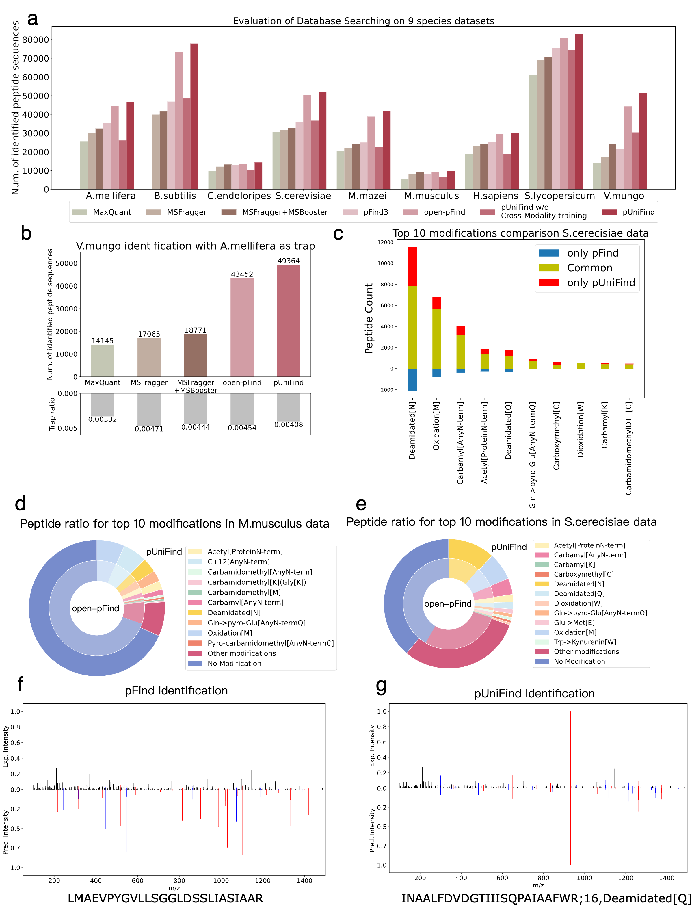

<!-- # pUniFind
This is the official repository for pUniFind, the most powerful zero-shot open peptide-spectrum scoring model and the first zero-shot open de novo sequencing deep learning model supporting over 1300 modifications.

Scoring evaluation can be seen below:

Zero-shot de novo sequencing evaluation can be seen below:

Performace of our model on hard cases can be seen below:


For now you may try our model on bohrium app here. Our arxiv preprint(including more details and more very careful evaluation on accuracy) will be released soon. Our source code will be released upon the acceptance of our paper.

## TODO
1. Update bohrium app to support TIMS and Astral data. (very soon)
2. Update bohrium app to support multi-gpu process. (very soon)
3. Specially finetune on some new modification (if needed)

If you found some bugs or if you need some more function, please donot hesitate to pull an issue here.

Staring our repository will remind you our updates. -->


# pUniFind: Unified large pretrained deep learning model pushing the limit of mass spectra interpretation

<!-- [](https://arxiv.org/abs/1234.56789)
[](https://www.apache.org/licenses/LICENSE-2.0) -->
[](https://github.com/pFindStudio/pUniFind/releases) [](https://bohrium.dp.tech/apps/punifind)
<!-- [](https://colab.research.google.com/github/your-repo/pUniFind) -->


This is the official repository for **pUniFind**, the most powerful zero-shot open peptide-spectrum scoring model surpassing other SOTA search engines and the first zero-shot open de novo sequencing deep learning model supporting over 1300 modifications. Developed by [pFind group](https://pfind.net/) and [DP Technology](https://www.dp.tech/en). We will release our arxiv preprint very soon.

## 🚀 Key Features
🔥 **Powerful open scoring performance.** Surpassing all former SOTA search enegines including open-pFind and MSFragger with MSBooster supporting over 1300 modifications. 

🔥 **High Accuracy.** Comprehensive experimental results demonstrate that the model exhibits no significant overfitting to either the target or decoy peptides in the training data, while maintaining high accuracy across different evaluation scenarios. More careful evaluations can be seen in our preprint.

🔥 **Zero-shot open de novo.** The first open de novo sequencing deep learning methods without the need for finetuning, supporting over 1300 modifications.

🔥 **De Novo reliable result filtering and user-friendly result file.** Based on various deep learning features, our model can effectively filter out unreliable results which is extremely useful for real world usage. Our user-friendly results file also contains end-to-end score, cos similarity, mass difference and missing fragment ion sites, which can better help user to evaluate its reliability. Result file also support visualization.

## &#x1F4E3; News
- **2025/5/25** pUniFind repository Initial Release 🚀.


<!-- ## 📊 Benchmark Performance
Details can be seen in our paper.

### 1. Scoring

<!--  -->
<!--  -->

<!-- ### 2. De Novo Sequencing
<!--  -->

<!-- ### 3. Challenging Cases
<!--  -->


## 🛠️ Getting Started

Please see our [user guide](User_guide.md).


<!-- ```bash
# Requirements: Python 3.8+, CUDA 11.7+
git clone https://github.com/your-repo/pUniFind.git
cd pUniFind
pip install -r requirements.txt

# Inference Example
python predict.py \
  --input ./data/spectra.mzML \
  --output ./results.csv \
  --modification_config ./configs/open_mods.yaml \
  --device cuda:0
``` -->

## 🛠️ Technical Support  
Should you encounter any technical issues, suggestions, observe suboptimal performance, or identify inconsistencies between pUniFind results and our evaluation metrics, we welcome your feedback 🙏. We are looking for bad cases to further refine our model. If you have any suggestions about our software, please do not hesitate to contact us. We are **actively** updating and refining our software, since the main author is **far** from graduation :(.

We provide **priority support** for user-reported issues through the following channels:  

**For technical inquiries:**  
1. **GitHub Issues**: [Open a new issue](https://github.com/pFindStudio/pUniFind/issues) with:  
   - Data description.  
   - Error logs and environment.
   - Uploaded folder description  

1. **pFind Studio user support WeChat group**: 
   - Please add my WeChat: ```JL_Zhao2000```, and I will invite you into our user support group. (Because WeChat invitation expires in one week.)

**For collaboration requests:**  
📧 **Contact info**: Jiale Zhao.  Email: [zhaojiale22z@ict.ac.cn](mailto:zhaojiale22z@ict.ac.cn) or [marshmallowzjl@gmail.com](mailto:marshmallowzjl@gmail.com).

## 📅 Roadmap
**Staring** and **watching** our repo will remind you of our updates. We will keep optimizing our model.
| Milestone         | Status |
|-------------------|--------|
| Post arxiv preprint |  🚄 very soon |
| TIMS / Astral Support | 🚄 very soon |
| nce option (currently use default 25 as input) | 🚄 very soon |
| Integarating pUniFind into open-pFind | 🚧 Preparing |
| User-defined new PTM Tuning | 📝 Planning |
| Improving the performance and speed of scoring and de novo sequencing. | 📝 Long-term |

## 🤝 Citation <a name="-citation"></a>
If you find our software is useful and helped your research,  **please cite** us 🙏 through:
```bash
Waiting for bioxiv
```
Your every citation will motivate the main author to make pUniFind more user-friendly and powerful. The main author needs your valuable citations and stars to find a job after graduation 😫.
