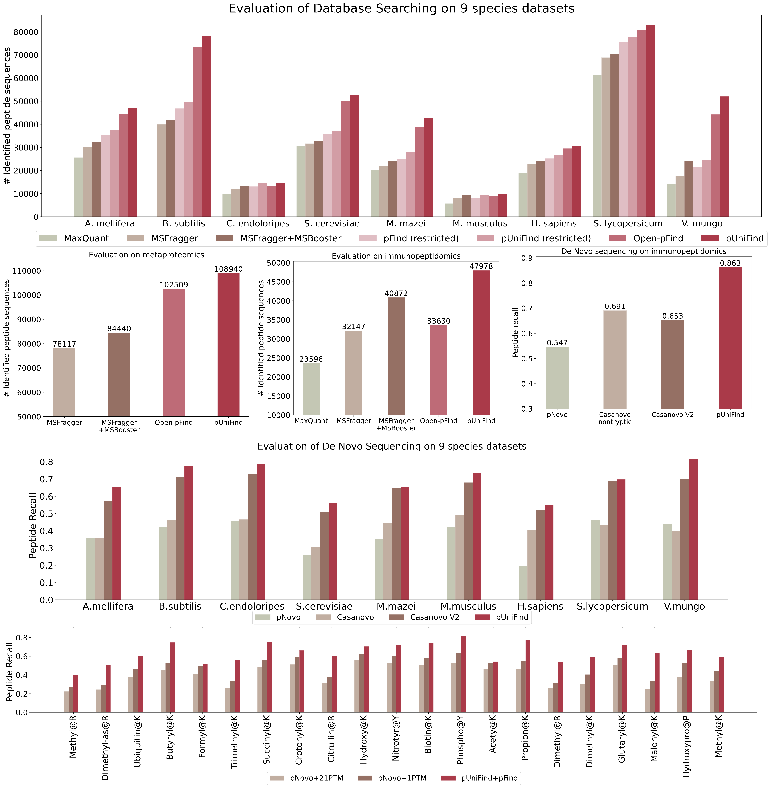

# pUniFind: Unified large pretrained deep learning model pushing the limit of mass spectra interpretation

<!-- [](https://arxiv.org/abs/1234.56789)
[](https://www.apache.org/licenses/LICENSE-2.0) -->

[](https://arxiv.org/abs/2507.00087) [](https://github.com/pFindStudio/pUniFind/releases) [](https://bohrium.dp.tech/apps/punifind)
<!-- [](https://colab.research.google.com/github/your-repo/pUniFind) -->
<div style="text-align: center; line-height: 1.8; margin-bottom: 25px;">
  <a href="User_guide_chinese.md" style="margin-right: 15px;">中文用户手册</a> | 
  <a href="User_guide.md" style="margin-left: 15px;">User Manual</a>
</div>


This is the official repository for **pUniFind**, the most powerful zero-shot open peptide-spectrum scoring model surpassing other SOTA search engines and the first zero-shot open de novo sequencing deep learning model supporting over 1300 modifications. Developed by [pFind group](https://pfind.net/) and [DP Technology](https://www.dp.tech/en).


## 🚀 Key Features
🔥 **Powerful open scoring performance.** Surpassing all former SOTA search enegines including open-pFind and MSFragger with MSBooster supporting over 1300 modifications. 

🔥 **High Accuracy.** Comprehensive experimental results demonstrate that the model exhibits no significant overfitting to either the target or decoy peptides in the training data, while maintaining high accuracy across different evaluation scenarios. More careful evaluations can be seen in our preprint.

🔥 **Zero-shot open de novo.** The first open de novo sequencing deep learning methods without the need for finetuning, supporting over 1300 modifications.

🔥 **De Novo reliable result filtering and user-friendly result file.** Based on various deep learning features, our model can effectively filter out unreliable results which is extremely useful for real world usage. Our user-friendly results file also contains end-to-end score, cos similarity, mass difference and missing fragment ion sites, which can better help user to evaluate its reliability. Result file also support visualization.

## &#x1F4E3; News
- **2025/11/29** pUniFind released linux source code preview!🚀. (We will optimize the user experience in the near future, This is just a preview version linux source code.)
- **2025/6/24** pUniFind supports timsTOF open de novo sequencing.
- **2025/5/25** pUniFind repository Initial Release 🚀.


## 📊 Benchmark
Details can be seen in our paper.




## 🛠️ Getting Started

Please see our [user guide](User_guide.md).


## 🛠️ Technical Support  
Should you encounter any technical issues, suggestions, observe suboptimal performance, or identify inconsistencies between pUniFind results and our evaluation metrics, we welcome your feedback 🙏. We are looking for bad cases to further refine our model. We can improve performance in 50% of poor cases using our proprietary, complex methods, which is why we have not released them publicly. If you have any suggestions about our software, please do not hesitate to contact us. We are **actively** updating and refining our software, since the main author is **far** from graduation :(.

If you encounter any issues running pUniFind, please first refer to the FAQ section in the [User Guide](User_guide.md). If your problem persists, priority support is available for user-reported issues through the following channels. We will respond to you as promptly as possible:

**For technical inquiries:**  
1. **GitHub Issues**: [Open a new issue](https://github.com/pFindStudio/pUniFind/issues) with:  
   - Data description.  
   - Error logs and environment.
   - Uploaded folder description  

1. **pFind Studio user support WeChat group**: 
   - Please add my WeChat: ```JL_Zhao2000```, and I will invite you into our user support group. (Because WeChat invitation expires in one week.)

**For collaboration requests:**  
📧 **Contact info**: Jiale Zhao.  Email: [zhaojiale22z@ict.ac.cn](mailto:zhaojiale22z@ict.ac.cn) or [marshmallowzjl@gmail.com](mailto:marshmallowzjl@gmail.com).

## 📅 Roadmap
**Staring** and **watching** our repo will remind you of our updates. We will keep optimizing our model.
| Milestone         | Status |
|-------------------|--------|
| nce option (currently use default 25 as input) | 🚄 very soon |
| Integarating pUniFind into open-pFind | 🚧 Preparing |
| User-defined new PTM Tuning | 📝 Planning |
| Improving the performance and speed of scoring and de novo sequencing. | 📝 Long-term |

## 🤝 Citation <a name="-citation"></a>
If you find our software is useful and helped your research,  **please cite** us 🙏 through:
```bash
@misc{zhao2025punifindunifiedlargepretrained,
      title={pUniFind: a unified large pre-trained deep learning model pushing the limit of mass spectra interpretation}, 
      author={Jiale Zhao and Pengzhi Mao and Kaifei Wang and Yiming Li and Yaping Peng and Ranfei Chen and Shuqi Lu and Xiaohong Ji and Jiaxiang Ding and Xin Zhang and Yucheng Liao and Weinan E and Weijie Zhang and Han Wen and Hao Chi},
      year={2025},
      eprint={2507.00087},
      archivePrefix={arXiv},
      primaryClass={cs.LG},
      url={https://arxiv.org/abs/2507.00087}, 
}
```
Your every citation will motivate the main author to make pUniFind more user-friendly and powerful. The main author needs your valuable citations and stars to find a job after graduation 😫.
